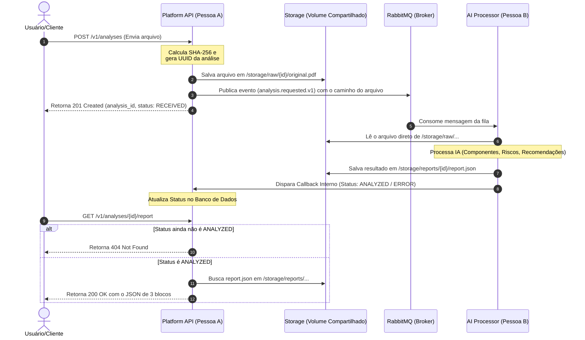

# Arquitetura do Sistema e Fluxo de Dados

O diagrama abaixo representa a interação assíncrona entre a Plataforma (Pessoa A) e o Processador de IA (Pessoa B) utilizando armazenamento local compartilhado e RabbitMQ.

